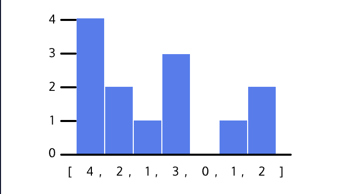
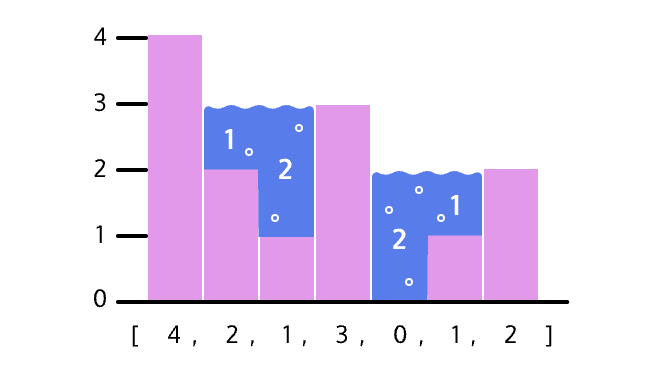

# Capturing Rainwater

A common interview question involving arrays is the “capturing rainwater” problem (also referred to as the “trapping rainwater” problem). This problem involves finding the amount of rainwater that can be trapped between bars in a bar chart.

## The Problem

The capturing rainwater problem asks you to calculate how much rainwater would be trapped in the empty spaces in a histogram (a chart which consists of a series of bars). Consider the following histogram:



This can be represented in JavaScript as an array filled with the values [4, 2, 1, 3, 0, 1, 2]. Imagine that rainwater has fallen over the histogram and collected between the bars. Here’s how the previous histogram would look filled with water:



Like with the road, the amount of water that can be captured at any given space cannot be higher than the bounds around it. To solve the problem, we need to write a function that will take in an array of integers and calculate the total water captured. Our function would return 6 for the histogram above. There are multiple ways to solve this problem, but we are going to focus on a naive implementation and an optimized implementation.

### The Concept

The foundation to all the solutions for this problem is that the amount of rainwater at any given index is the difference between the lower of highest bars to its left and right and the height of the index itself:

**waterAtIndex = Math.min(highestLeftBound, highestRightBound) - heightOfIndex;**

Look at the histogram again. The amount of water at index 4 is 2. This is because its highest left bound is 3 (element at index 3), and its highest right bound is 2 (element at index 6). The lower of these two values is 2, and when we subtract the index’s height of 0, we get our answer of 2.

### The Naive Solution

The naive solution to the problem is to:

1. Traverse every element in the array
2. Find the highest left bound for that index
3. Find the highest right bound for that index
4. Take the lower of those two values
5. Subtract the height of that index from that minimum
6. Add the difference to the total amount of water

While this is a functional solution, it requires nested for loops, which means it has a big O runtime of O(n^2).

### The Optimized Solution

The previous solution had a quadratic runtime, but it’s possible to solve this problem in O(n) time by using two pointers. The pointers will start at each end of the array and move towards each other. The two-pointer approach is a common approach for problems that require working with arrays, as it allows you to go through the array in a single loop and without needing to create copy arrays.

We’ll start by creating the following variables:

```plaintext
totalWater = 0
leftPointer = 0
rightPointer = heights.length - 1
leftBound = 0
rightBound = 0
```

leftPointer and rightPointer will start at the beginning and end of the array, respectively, and move towards each other until they meet. The algorithm is as follows:

```plaintext
while leftPointer < rightPointer
  if the element at leftPointer <= the element at rightPointer
    if the element is larger than leftBound, set leftBound to the element
    add the difference between leftBound and the element at leftPointer to totalWater
    move leftPointer forward by one
  else
    if the element is larger than rightBound, set rightBound to the element
    add the difference between rightBound and the element at rightPointer to totalWater
    move rightPointer back by one

return totalWater
```

## Time Complexity

The time complexity of the naive solution is O(n^2) because we need to traverse the array for each element to find the highest left and right bounds.
The time complexity of the optimized solution is O(n) because we only need to traverse the array once.

## Space Complexity

- The space complexity of the naive solution is O(1) as it only uses a few variables for calculations.
- The space complexity of the optimized solution is O(1) as well since it does not require any additional data structures.

## The Two Pointer Approach

When you see a problem that requires you to iterate through an array (or string), take a moment and think about if it would be possible to iterate through it in sections at the same time instead of in separate loops. Common problems that can be solved using the two-pointer technique are the two sum problem (finding two numbers in an array that sum to a specified number) and reversing the characters in a string.

### References

- [Codecademy](https://www.codecademy.com)
