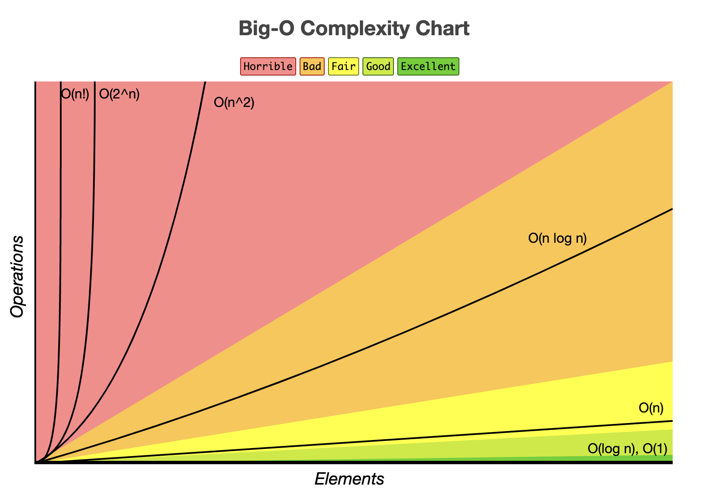

# Asymptotic Notation

Asymptotic notation is used to describe the efficiency of an algorithm. It is used to describe the performance of an algorithm as the input size grows to infinity. It is used to describe the best case, worst case, and average case scenarios of an algorithm.

## Big O Notation - O

Big O notation is used to describe the worst case scenario of an algorithm.

## Big Omega Notation - Ω

Big Omega notation is used to describe the best case scenario of an algorithm.

## Big Theta Notation - Θ

It is used to describe the average case scenario of an algorithm. We use big Theta when a program has only one case in terms of runtime.

### Common Runtimes

- Θ(1). This is constant runtime. This is the runtime when a program will always do the same thing regardless of the input. For instance, a program that only - - prints “hello, world” runs in Θ(1) because the program will always just print “hello, world”.
- Θ(log N). This is logarithmic runtime. You will see this runtime in search algorithms.
- Θ(N). This is linear runtime. You will often see this when you have to iterate through an entire dataset.
- Θ(N\*logN). You will see this runtime in sorting algorithms.
- Θ(N2). This is an example of a polynomial runtime. When N is raised to the 2nd power, it’s known as a quadratic runtime. You will see this runtime when you have to search through a two-dimensional dataset (like a matrix) or nested loops.
- Θ(2N). This is exponential runtime. You will often see this runtime in recursive algorithms.
- Θ(N!). This is factorial runtime. You will often see this runtime when you have to generate all of the different permutations of something. For instance, a program that generates all the different ways to order the letters “abcd” would run in this runtime.



#### Space Complexity

Space complexity is a measure of the amount of working storage an algorithm needs. It is used to describe the amount of memory an algorithm uses as the input size grows to infinity.

```js
function addNumbers(a, b) {
  return a + b;
}
```

This function has a space complexity of O(1), because the amount of space it needs will not change based on the input. While this function also has a constant runtime of O(1), most functions do not have matching space and time complexities.

```js
function simpleLoop(inputArray) {
  for (let i = 0; i < inputArray.length; i++) {
    console.log(i);
  }
}
```

As we know, a simple for loop that goes through every element in an array of size n has a linear runtime of O(n). However, this function takes O(1) space since no new variables are being created and therefore no more space must be allocated.

Like with time complexity, space complexity denotes space growth in relation to the input size. It’s also important to note that space complexity usually refers to any additional space that will be needed, and doesn’t count the space of the input. So a function could have 10 arrays passed into it, but if all it does inside is print 'Hello World!', then it still takes O(1) space.

##### Summary

In summary, asymptotic notations are essential for analyzing the performance of algorithms, allowing developers to select the most efficient algorithms for their needs.
