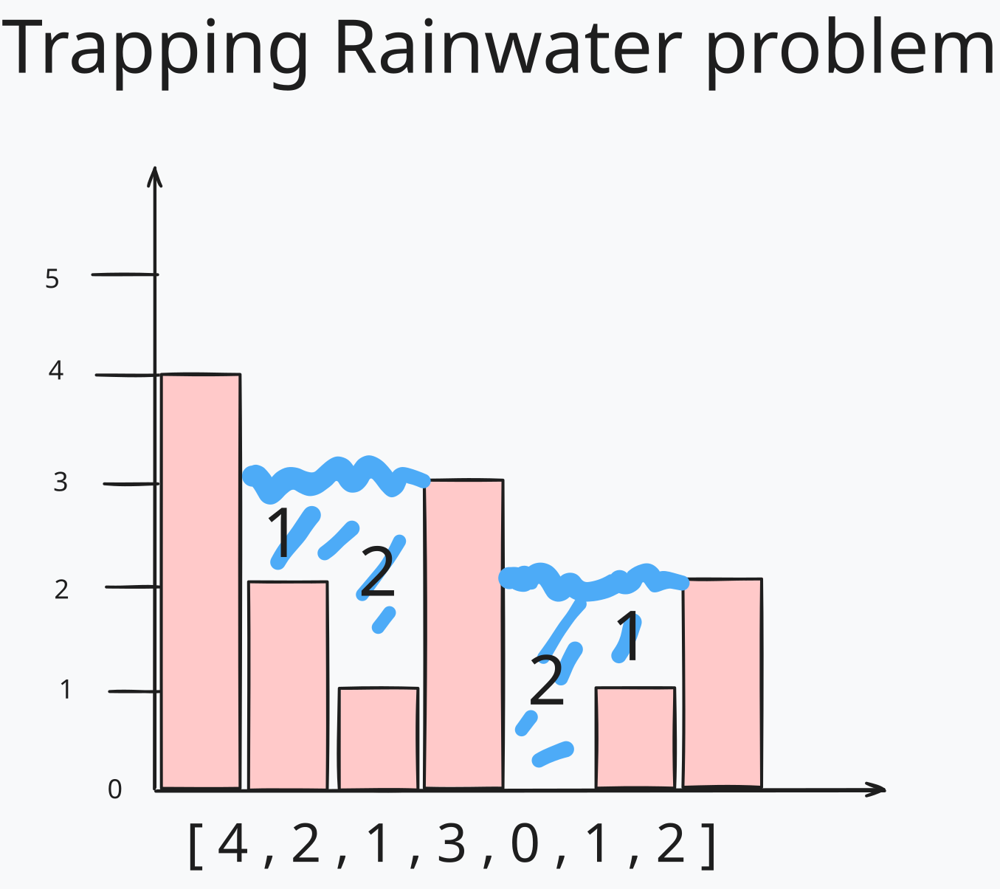

# Capturing Rainwater

A common problem in computer science is the problem of capturing rainwater. Given an array of integers representing the heights of walls, the task is to determine the amount of rainwater that can be captured between the walls.

The capturing rainwater problem asks you to calculate how much rainwater would be trapped in the empty spaces in a histogram (a chart which consists of a series of bars). Consider the following histogram:

In this histogram, the walls are represented by the bars. The empty spaces between the walls are the areas where rainwater can be captured. The task is to calculate the amount of rainwater that can be captured in these empty spaces.

## The concept

The foundation to all the solutions for this problem is that the amount of rainwater at any given index is the difference between the lower of highest bars to its left and right and the height of the index itself:

**waterAtIndex = Math.min(highestLeftBound, highestRightBound) - heightOfIndex;**

The highest bar to the left of the index is the maximum height of the bars to the left of the index. Similarly, the highest bar to the right of the index is the maximum height of the bars to the right of the index.

### The Naive Solution

The naive solution to this problem is to calculate the amount of rainwater at each index by finding the highest bars to the left and right of the index. The amount of rainwater at the index is the difference between the lower of the two highest bars and the height of the index. The total amount of rainwater is the sum of the rainwater at each index.

The time complexity of this solution is O(n^2) because for each index, we have to find the highest bars to the left and right of the index. This requires traversing the array for each index.

### The Optimized Solution

Using two pointers, we can optimize the solution to O(n). The idea is to keep track of the highest bars to the left and right of each index. We can do this by creating two arrays, `leftMax` and `rightMax`, where `leftMax[i]` is the maximum height of the bars to the left of index `i`, and `rightMax[i]` is the maximum height of the bars to the right of index `i`.

## Time Complexity

The time complexity of the optimized solution is O(n) because we only traverse the array once to calculate the `leftMax` and `rightMax` arrays. The space complexity is also O(n) because we use two arrays of size n to store the maximum heights of the bars to the left and right of each index.

The time complexity of the naive solution is O(n^2) because for each index, we have to find the highest bars to the left and right of the index. This requires traversing the array for each index. The space complexity is O(1) because we only use a constant amount of space.
