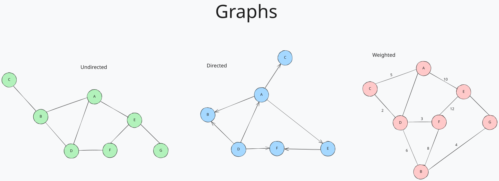

# Graphs

Graphs are a collection of `nodes` `(vertices)` and `edges` that connect them. They are used to model relationships between objects. Graphs can be `directed` or `undirected`, and can have `weighted` or `unweighted` edges. Graphs can be represented in a variety of ways, including `adjacency lists` and `adjacency matrices`. Graphs can be traversed using `depth-first search (DFS)` or `breadth-first search (BFS)`. Graphs can be used to solve a variety of problems, including shortest path problems, network flow problems, and more. Graphs are used in a variety of applications, including social networks, maps, and computer networks.

- `vertex:` A node in a graph.
- `edge:` A connection between two vertices.
- `adjacent:`` Two vertices that are connected by an edge.
- `path:` A sequence of edges that allows you to travel from one vertex to another.
- `disconnected:` Two vertices that are not connected by an edge.
- `weighted:` A graph where each edge has a weight or cost associated with it.
- `directed:` A graph where edges have a direction associated with them.
- `cycle:` A path that starts and ends at the same vertex.
- `acyclic:` A graph that does not contain any cycles.
- `connected:` A graph where there is a path between every pair of vertices.
- `adjacency matrix:` A matrix that represents the connections between vertices in a graph using rows and columns. A value of 1 indicates an edge between two vertices, and a value of 0 indicates no edge.
- `adjacency list:` A list that represents the connections between vertices in a graph using linked lists or arrays. Each vertex has a list of adjacent vertices.
- `traversal:` The process of visiting all the nodes in a graph in a systematic way.
- `traversal:` The process of visiting all the nodes in a graph in a systematic way.

## Operations

- Adding a vertex
- Adding an edge between vertices
- Removing a vertex
- Removing an edge
- Traversal (Depth-First Search, Breadth-First Search)
