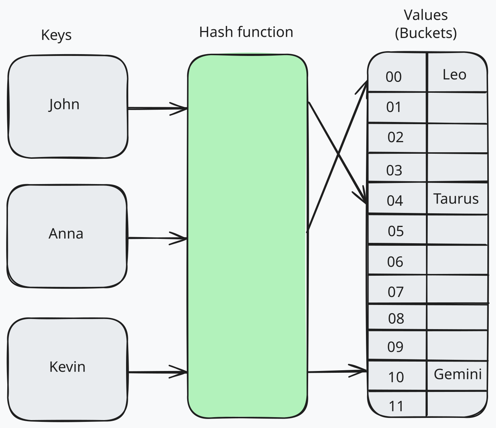

# Hash maps

`Hash maps` map keys to their related values, and are one of the most efficient data structures when it comes to retrieving stored data. This is because the key associated with every value added allows for faster retrieval later on. Hash maps are also known as `hash tables`, `maps`, `dictionaries`, or `associative arrays`. They are widely used in computer science and software engineering to store and retrieve data efficiently. In order for a relationship to be a map, every key that is used can only be the key to a single value. This means that the keys must be unique. However, the values can be duplicated.

Hash maps are implemented using an `array` of `fixed size`. Each element in the array is called a `bucket`. Each bucket can store multiple `key-value` pairs. When a key-value pair is added to the hash map, the key is hashed to determine the index of the bucket where the pair will be stored. The value is then stored in the bucket at that index. When retrieving a value from the hash map, the key is hashed to determine the index of the bucket where the value is stored. The value is then retrieved from the bucket at that index.

- `Hash map:` A key-value store that uses an array and a hashing function to save and retrieve values.
- `Key:` The identifier given to a value for later retrieval.
- `Hash function:` A function that takes some input and returns a number.
- `Compression function:` A function that transforms its inputs into some smaller range of possible outputs.
- `Bucket:` A single unit in the array where key-value pairs are stored.

**Recipe for saving to a hash table:**

- Take the key and plug it into the hash function, getting the hash code.
- Modulo that hash code by the length of the underlying array, getting an array index.
- Check if the array at that index is empty, if so, save the value (and the key) there.
- If the array is full at that index, continue to the next possible position depending on your collision strategy.

**Recipe for retrieving from a hash table:**

- Take the key and plug it into the hash function, getting the hash code.
- Modulo that hash code by the length of the underlying array, getting an array index.
- Check if the array at that index has contents, if so, check the key saved there.
- If the key matches the one you're looking for, return the value.
- If the keys don't match, continue to the next position depending on your collision strategy.

## Key Characteristics

- **Efficiency:** Fast retrieval and storage operations.
- **Uniqueness of Keys:** Each key maps to a single value.
- **Storage in Buckets:** Buckets can handle multiple key-value pairs.
- **Hash Function:** Determines the index for storage and retrieval.

## References

Front End Engineer Career Path / Interview Prep / Complex Data Structures / Hash Maps

- [Codecademy](https://www.codecademy.com)
