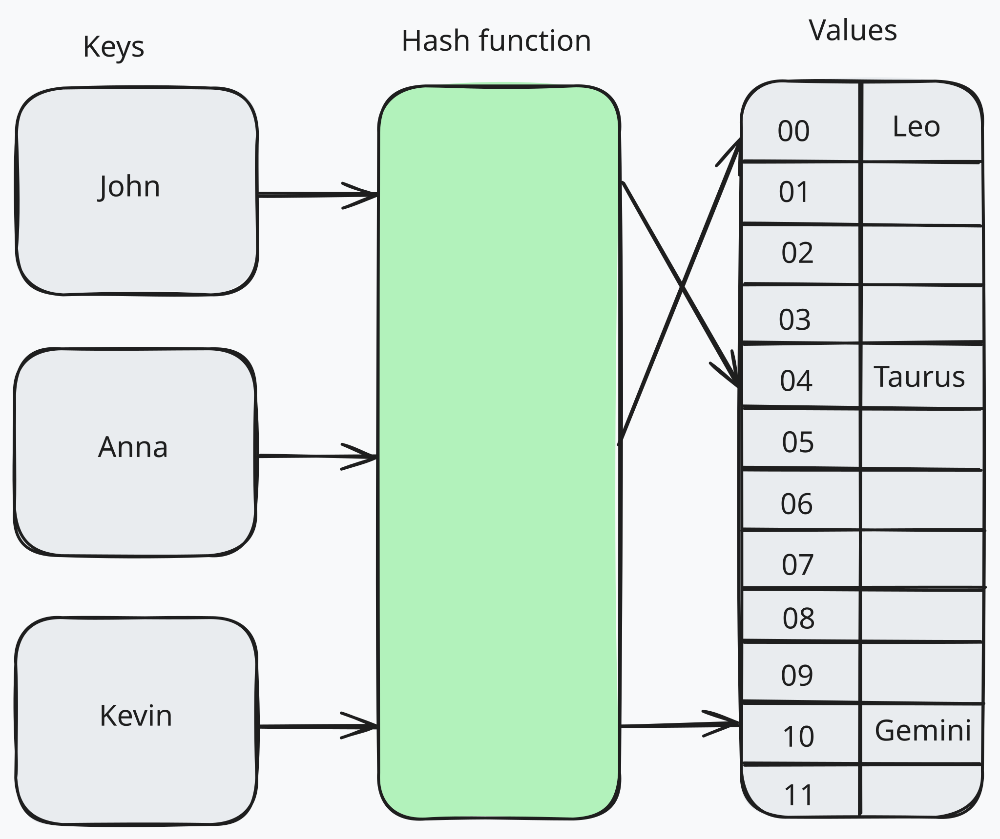

# Hash maps

Hash maps map keys to their related values, and are one of the most efficient data structures when it comes to retrieving stored data. This is because the key associated with every value added allows for faster retrieval later on. Hash maps are also known as hash tables, maps, dictionaries, or associative arrays. They are widely used in computer science and software engineering to store and retrieve data efficiently. In order for a relationship to be a map, every key that is used can only be the key to a single value. This means that the keys must be unique. However, the values can be duplicated.
