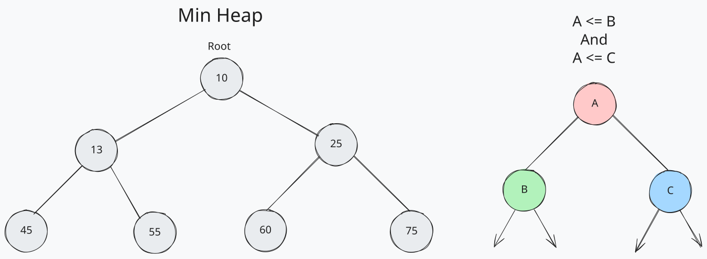
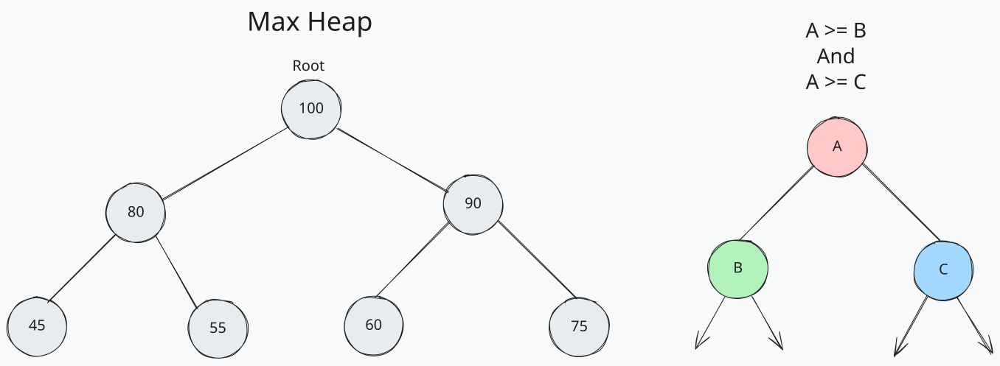

# Heaps

Heaps are another variation of the tree data structure and are adept at keeping track of the maximum or minimum value held within, referred to as max-heaps and min-heaps, respectively. Specifically, heaps are a type of binary tree, since each child node is either greater or less than its parent (depending on if it’s a max-heap or min-heap). They are efficient for accessing the root value, which will either be the max or min (again, depending on the type of heap) and inserting new values.

In Min Heap the root node is the smallest value in the heap, and each parent node is smaller than its children.

In Max Heap the root node is the largest value in the heap, and each parent node is larger than its children.

Heapifying up and down are the two primary operations used to maintain the heap property. When a new value is inserted, it is added to the end of the heap and then heapified up to its correct position. When the root value is removed, the last value is moved to the root and heapified down to its correct position.

## Operations

- left child: (index \* 2) + 1
- right child: (index \* 2) + 2
- parent: (index - 1) / 2 - not used on the root!
