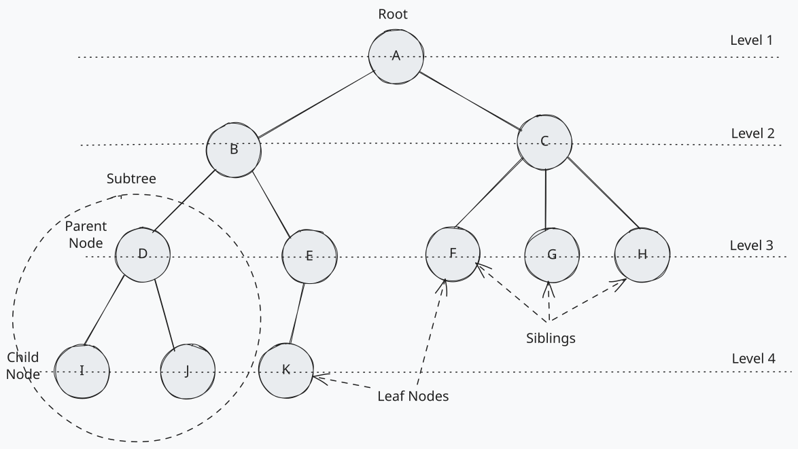

# Trees

Trees are an essential data structure for storing hierarchical data with a directed flow.
They are composed of nodes that are connected by edges. Each tree has a root node, and every node in the tree is connected by edges.
The root node is the topmost node in the tree, and it does not have any parent nodes. The nodes that are connected to the root node are called child nodes.
A node can have zero or more children. The node that has children is called the parent node. The nodes that do not have any children are called leaf nodes.

- root: A node which has no parent. One per tree.
- parent: A node which references other nodes.
- child: Nodes referenced by other nodes.
- sibling: Nodes which have the same parent.
- leaf: Nodes which have no children.
- level: The height or depth of the tree. Root nodes are at level 1, their children are at level 2, and so on.

Trees come in various shapes and sizes depending on the dataset modeled.

Some are wide, with parent nodes referencing many child nodes.

Some are deep, with many parent-child relationships.

Trees can be both wide and deep, but each node will only ever have at most one parent; otherwise, they wouldn’t be trees!

Each time we move from a parent to a child, we’re moving down a level. Depending on the orientation we refer to this as the depth (counting levels down from the root node) or height (counting levels up from a leaf node).

Trees are used in computer science and software engineering to represent data in a hierarchical manner. They are used in various applications, such as file systems, databases, and network routing algorithms.
Trees are also used in algorithms like binary search trees, AVL trees, and red-black trees to efficiently store and retrieve data.

A binary tree is a type of tree where each parent can have no more than two children, known as the left child and right child.

A binary search tree is a binary tree where the left child is less than the parent, and the right child is greater than the parent. This property allows for efficient searching, inserting, and deleting of values.
