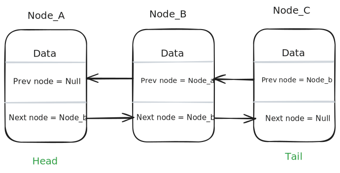
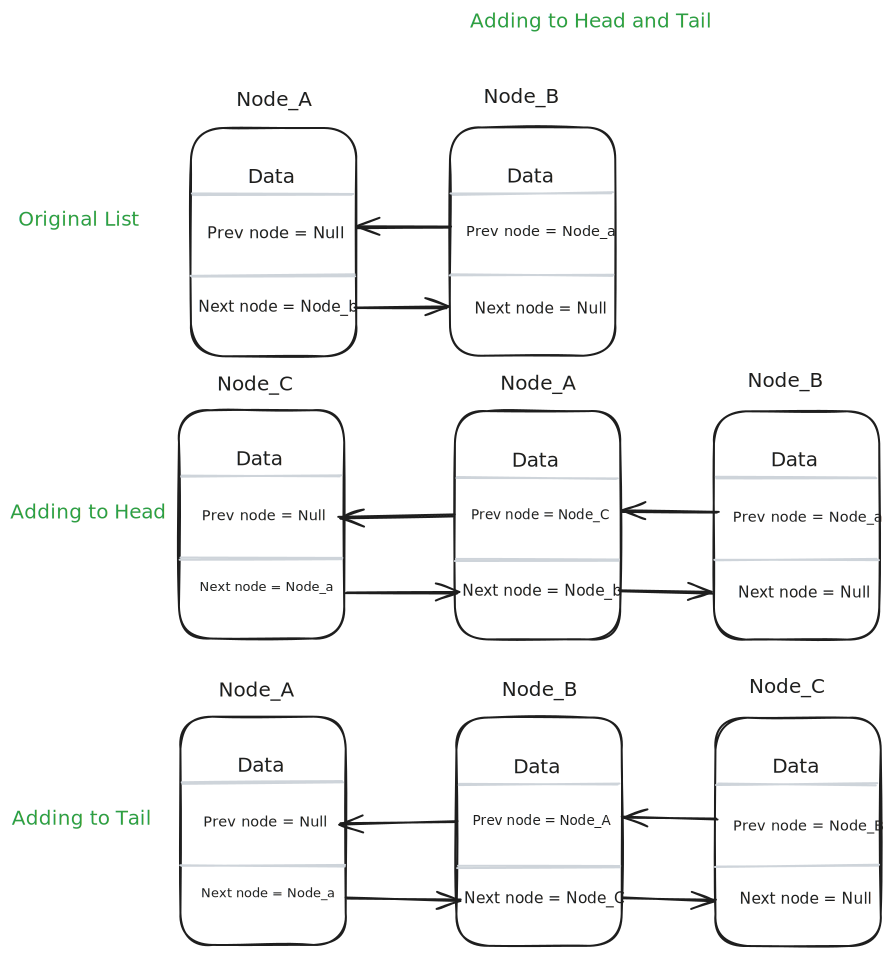
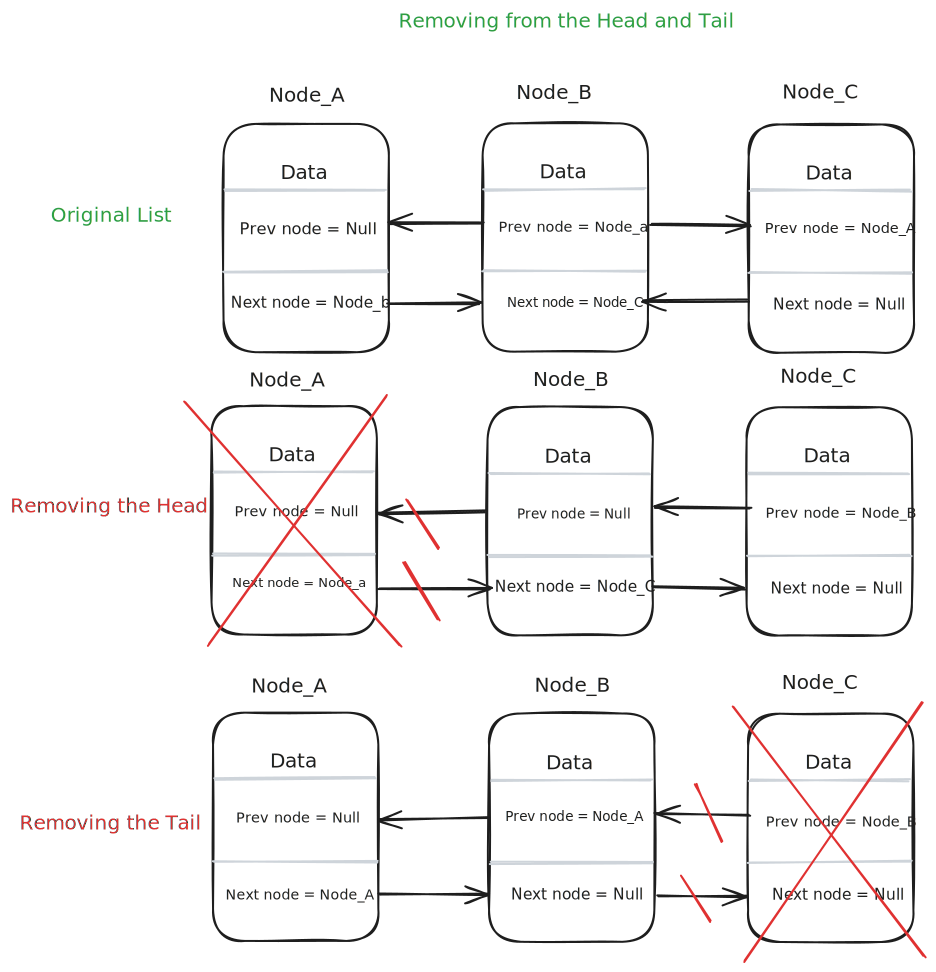
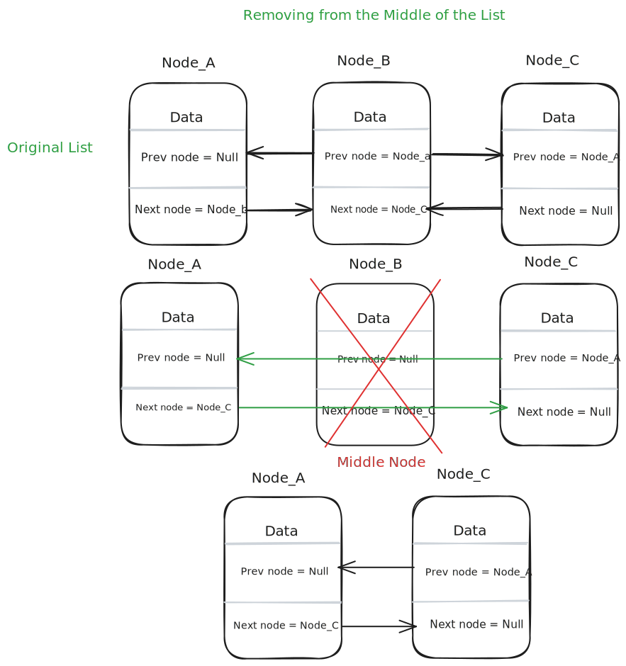

# Doubly Linked Lists

Like a singly linked list, a doubly linked list is comprised of a series of nodes. Each node contains data and two links (or pointers) to the next and previous nodes in the list. The head node is the node at the beginning of the list, and the tail node is the node at the end of the list. The head node’s previous pointer is set to null and the tail node’s next pointer is set to null.

Think of your daily commute on the subway as a real-world example of a doubly linked list. Your home is the head of the list, your place of work is the tail, and every stop in between is another node in the list. In the morning when you take the subway to get to work, you are traversing the list from the head to the tail, using the stop’s next pointer. While this can also be done using a singly linked list, a doubly linked list will also allow you to traverse back through the list easily, using the stop’s previous pointer. You will take the exact same route to get home, just in reverse.

## Common Operations

- **Insertion**: Adding nodes to both ends of the list

- **Deletion**: Removing nodes from both ends of the list

- **Traversal**: Traversing (or traveling through) the list

- **Search**: Finding, and removing, a node from anywhere in the list

- **Access**: Retrieve the value of a node at a specific position.

---

---

---

## Complexities

### Time Complexity

For searching and accessing an element in a doubly linked list, the time complexity is O(n) in the worst case, as we may have to traverse the entire list to find the element. For insertion and deletion, the time complexity is O(1) when inserting or deleting from the head or tail of the list, as we only need to update the head or tail references. For inserting or deleting from any other location in the list, the time complexity is O(n), as we may have to traverse the list to find the location.

| Access | Search |   Insertion    |    Deletion    |
| :----: | :----: | :------------: | :------------: |
|  O(n)  |  O(n)  | O(1) - on head | O(1) - on head |
|        |        | O(1) - on tail | O(1) - on tail |
|        |        | O(n) - on any  | O(n) - on any  |
|        |        | other location | other location |
|        |        |  (Traversing)  |  (Traversing)  |

### Space Complexity

Space complexity for a doubly linked list is O(n), as we are storing n elements in the list.

## References

- [Codecademy](https://www.codecademy.com)
