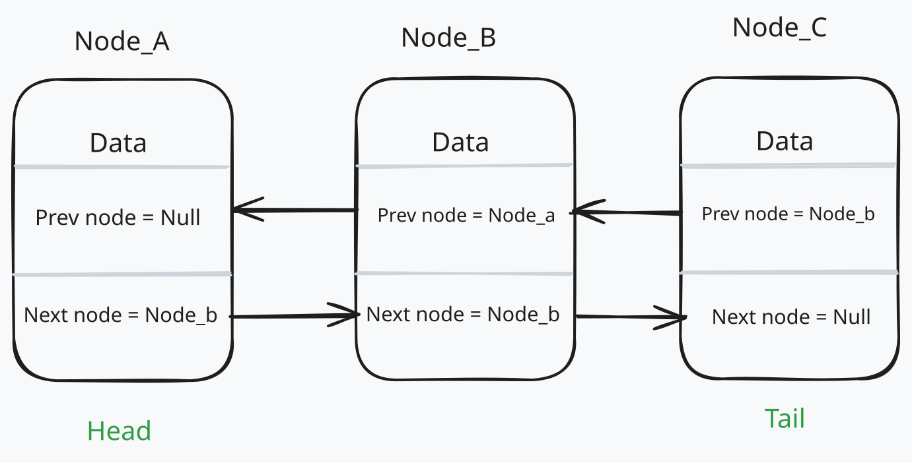
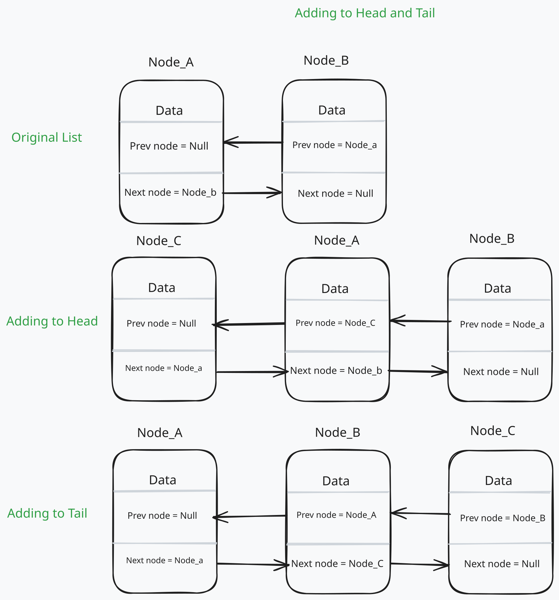
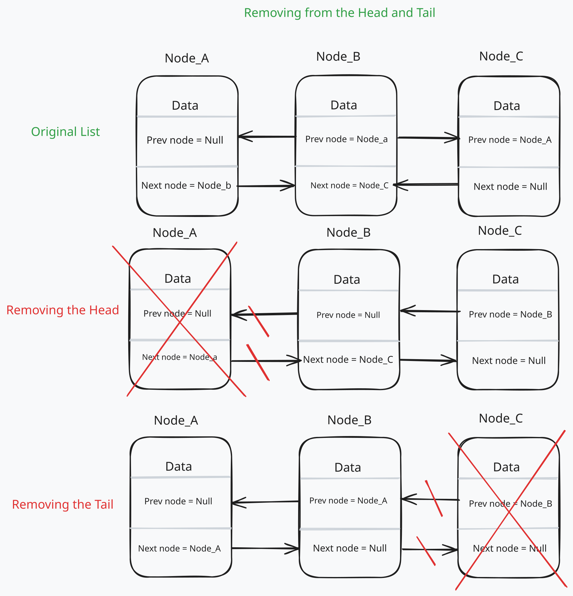
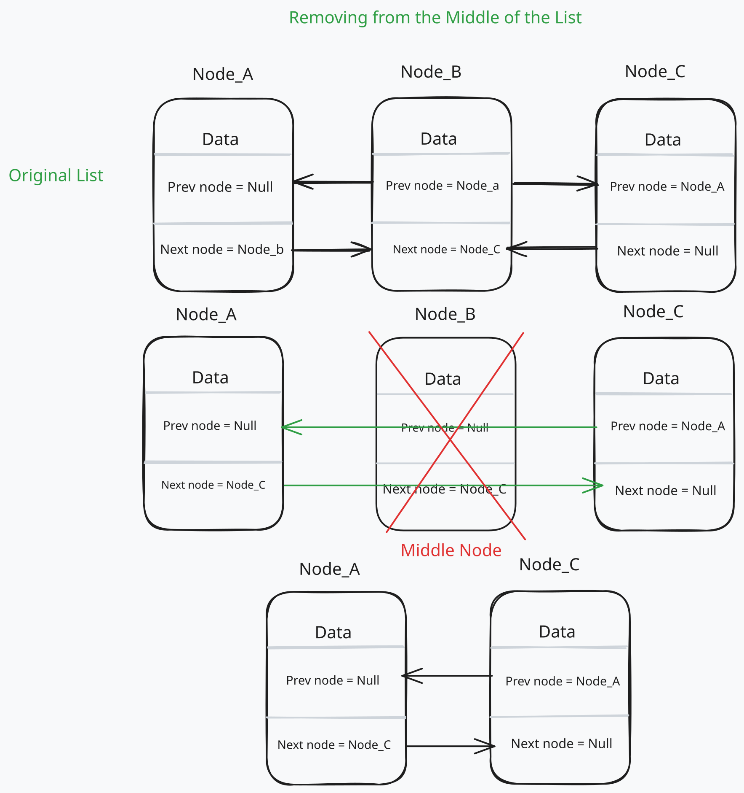

# Doubly Linked Lists

Doubly linked lists are a type of linked list where each node contains references to both the next node and the previous node in the sequence. This allows for bidirectional traversal of the list, meaning you can traverse the list in both forward and backward directions. The first node in the list is called the head, and the last node is called the tail. The head node has a reference to null for the previous node, and the tail node has a reference to null for the next node.

Think of a doubly linked list as a subway system where each station has a connection to the next station and the previous station. This allows you to travel in both directions along the subway line. In a doubly linked list, each node is like a station, and the connections between the stations allow you to move forward and backward through the list. Your home station is the head of the list, and the end of the line is the tail. You can travel in either direction along the subway line, just like you can traverse a doubly linked list in either direction.

## Common Operations

- **Insertion**: Adding nodes to both ends of the list

- **Deletion**: Removing nodes from both ends of the list

- **Traversal**: Traversing (or traveling through) the list

- **Search**: Finding, and removing, a node from anywhere in the list

- **Access**: Retrieve the value of a node at a specific position.

---

---

---

## Complexities

### Time Complexity

For searching and accessing an element in a doubly linked list, the time complexity is O(n) in the worst case, as we may have to traverse the entire list to find the element. For insertion and deletion, the time complexity is O(1) when inserting or deleting from the head or tail of the list, as we only need to update the head or tail references. For inserting or deleting from any other location in the list, the time complexity is O(n), as we may have to traverse the list to find the location.

| Access | Search |   Insertion    |    Deletion    |
| :----: | :----: | :------------: | :------------: |
|  O(n)  |  O(n)  | O(1) - on head | O(1) - on head |
|        |        | O(1) - on tail | O(1) - on tail |
|        |        | O(n) - on any  | O(n) - on any  |
|        |        | other location | other location |
|        |        |  (Traversing)  |  (Traversing)  |

### Space Complexity

Space complexity for a doubly linked list is O(n), as we are storing n elements in the list.

## Use Cases

Doubly linked lists are used in a variety of applications. For example, doubly linked lists are used in web browsers to implement the forward and back buttons. In text editors, doubly linked lists are used to implement undo and redo functionality. In operating systems, doubly linked lists are used to implement task scheduling. In computer science, doubly linked lists are used in algorithms like quicksort and mergesort.
