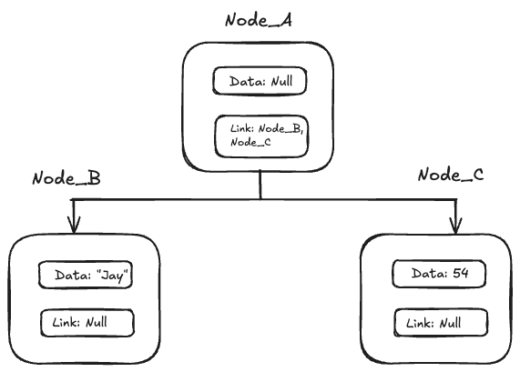

# Nodes

Nodes form the basis of all data structures. They are the building blocks for more complex data structures like linked lists, stacks, queues, and trees.

A Node consists of two key pieces of information: the data and a reference to the next node.

The data can be any data type, and the reference to the next node is a pointer to another instance of a Node.

This reference is what allows nodes to be linked together to form more complex data structures.
