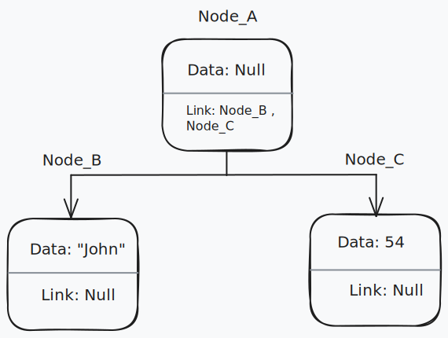
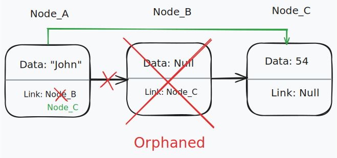

# Nodes

Nodes form the basis of all data structures. They are the building blocks for more complex data structures like linked lists, stacks, queues, and trees.

A Node consists of two key pieces of information: the data and a reference to the next node.

The data can be any data type, and the reference to the next node is a pointer to another instance of a Node. The link or links within the node are sometimes referred to as pointers, references, or links. This reference is what allows nodes to be linked together to form more complex data structures.

If a link is Null, it indicates that you have reached the end of the data structure.

An orphaned node is a node that is not linked to any other nodes. This can happen if you remove a node from a data structure without updating the links to the surrounding nodes. If you have a reference to an orphaned node, you can no longer access the rest of the data structure. For example, if you have node_a -> node_b -> node_c, and you remove node_b without updating the links, you will have node_a -> node_c, and node_b will be orphaned. You can no longer access node_c from node_a. You can avoid orphaned nodes by updating the links when you remove a node from a data structure. In this case , you would update node_a to point to node_c.

## References

- [Codecademy](https://www.codecademy.com)
