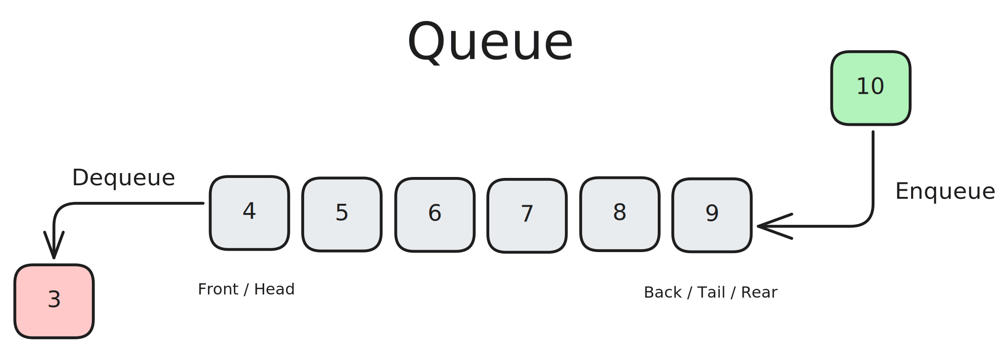

# Queues

A queue is a linear data structure that follows the First In First Out (FIFO) principle. This means that the first element added to the queue will be the first one to be removed. A queue is similar to a line of people waiting for a service, where the first person to arrive is the first to be served.

A queue is a linear collection of nodes that exclusively adds (enqueues) nodes to the tail, and removes (dequeues) nodes from the head of the queue. The head of the queue is the first node that was added, and the tail of the queue is the last node that was added.

Queues can be implemented using a linked list as the underlying data structure. The front of the queue is equivalent to the head node of a linked list and the back of the queue is equivalent to the tail node. Since operations are only allowed affecting the front or back of the queue, any traversal or modification to other nodes within the linked list is disallowed. Since both ends of the queue must be accessible, a reference to both the head node and the tail node must be maintained. One last constraint that may be placed on a queue is its length. If a queue has a limit on the amount of data that can be placed into it, it is considered a bounded queue. Similar to stacks, attempting to enqueue data onto an already full queue will result in a queue overflow. If you attempt to dequeue data from an empty queue, it will result in a queue underflow.

## Common Operations

- **Enqueue**: Adds data to the “back” or end of the queue

- **Dequeue**: Provides and removes data from the “front” or beginning of the queue

- **Peek**: Reveals data from the “front” of the queue without removing it

## Complexities

### Time Complexity

For searching and accessing an element in a doubly linked list, the time complexity is O(n) in the worst case, as we may have to traverse the entire list to find the element. For insertion and deletion, the time complexity is O(1) when inserting or deleting from the head or tail of the list, as we only need to update the head or tail references. For inserting or deleting from any other location in the list, the time complexity is O(n), as we may have to traverse the list to find the location.

| Access | Search |   Insertion    |    Deletion    |
| :----: | :----: | :------------: | :------------: |
|  O(n)  |  O(n)  | O(1) - on head | O(1) - on head |
|        |        | O(1) - on tail | O(1) - on tail |
|        |        | O(n) - on any  | O(n) - on any  |
|        |        | other location | other location |
|        |        |  (Traversing)  |  (Traversing)  |

### Space Complexity

Space complexity for a doubly linked list is O(n), as we are storing n elements in the list.

## Use Cases

## References

- [Codecademy](https://www.codecademy.com)
