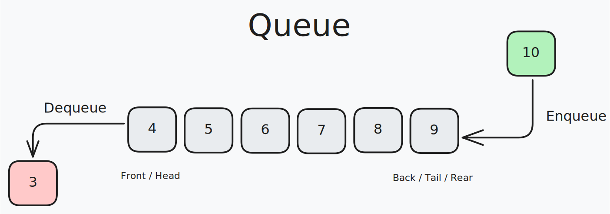

# Queues

A queue is a linear data structure that follows the First In First Out (FIFO) principle. This means that the first element added (enqueue) to the queue will be the first one to be removed (dequeue). A queue is similar to a line of people waiting for a service, where the first person to arrive is the first to be served.

Queues can be implemented using a linked list as the underlying data structure. The front of the queue is equivalent to the head node of a linked list and the back of the queue is equivalent to the tail node. Since operations are only allowed affecting the front or back of the queue, any traversal or modification to other nodes within the linked list is disallowed. Since both ends of the queue must be accessible, a reference to both the head node and the tail node must be maintained. One last constraint that may be placed on a queue is its length. If a queue has a limit on the amount of data that can be placed into it, it is considered a bounded queue. Similar to stacks, attempting to enqueue data onto an already full queue will result in a queue overflow. If you attempt to dequeue data from an empty queue, it will result in a queue underflow.

<!-- Queues can be implemented using an array as the underlying data structure. The front of the queue is equivalent to the first element of the array and the back of the queue is equivalent to the last element of the array. When the front of the queue is removed, all elements in the array must be shifted to the left to fill the gap. This operation has a time complexity of O(n). To avoid this, a circular queue can be implemented. In a circular queue, the front and back of the queue can wrap around the array. When the back of the queue reaches the end of the array, it can wrap around to the beginning of the array. This allows for the queue to be implemented with a fixed-size array without the need to shift elements. -->

## Common Operations

- **Enqueue**: Adds data to the “back” or end of the queue

- **Dequeue**: Removes data from the “front” or beginning of the queue

- **Peek**: Reveals data from the “front” of the queue without removing it

- **IsEmpty**: Determines if the queue is empty

- **IsFull**: Determines if the queue is full

## Complexities

### Time Complexity

| Enqueue | Dequeue | Peek | IsEmpty | IsFull |
| :-----: | :-----: | :--: | :-----: | :----: |
|  O(1)   |  O(1)   | O(1) |  O(1)   |  O(1)  |

### Space Complexity

The space complexity of a singly linked list queue is O(n), where n is the number of elements in the queue.

## Use Cases

Queues are used in a variety of applications. For example, queues are used in operating systems to manage processes and tasks. In networking, queues are used to manage data packets. In web servers, queues are used to manage requests. In computer science, queues are used in algorithms like breadth-first search and breadth-first traversal of trees.

## References

- [Codecademy](https://www.codecademy.com)
