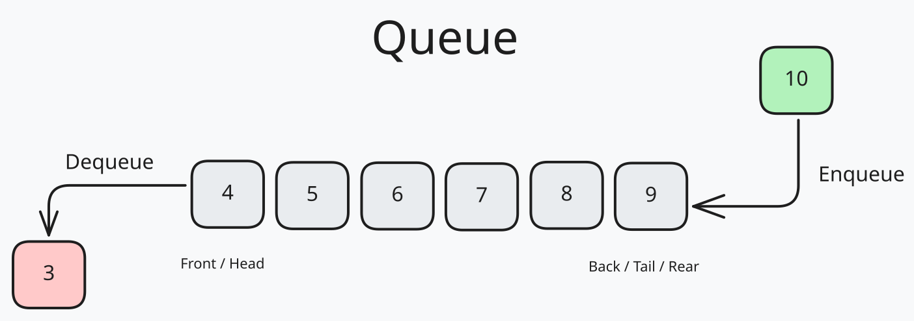

# Queues

A queue is a linear data structure that follows the First In First Out (FIFO) principle. This means that the first element added (enqueue) to the queue will be the first one to be removed (dequeue). A queue is similar to a line of people waiting for a service, where the first person to arrive is the first to be served.

Queues can be implemented using a linked list as the underlying data structure. In a linked list queue, each element in the queue is stored in a node, and each node has a reference to the next node in the queue. The front of the queue is the first node in the list, and the back of the queue is the last node in the list. Since operations are only allowed affecting the front or back of the queue, any traversal or modification to other nodes within the linked list is disallowed. Since both ends of the queue must be accessible, a reference to both the head node and the tail node must be maintained. One last constraint that may be placed on a queue is its length. If a queue has a limit on the amount of data that can be placed into it, it is considered a bounded queue. Similar to stacks, attempting to enqueue data onto an already full queue will result in a queue overflow. If you attempt to dequeue data from an empty queue, it will result in a queue underflow.

Queues can be implemented using an array as the underlying data structure. In an array queue, the front of the queue is the first element in the array, and the back of the queue is the last element in the array. When an element is dequeued, all the elements in the array must be shifted to the left to fill the gap left by the removed element. This can be an expensive operation, especially for large queues. To avoid this, a circular queue can be implemented, where the front and back of the queue wrap around the ends of the array. This allows for efficient enqueue and dequeue operations without the need to shift elements. However, a circular queue has a fixed size and can only hold a certain number of elements.

## Common Operations

- **Enqueue**: Adds data to the “back” or end of the queue

- **Dequeue**: Removes data from the “front” or beginning of the queue

- **Peek**: Reveals data from the “front” of the queue without removing it

- **IsEmpty**: Determines if the queue is empty

- **IsFull**: Determines if the queue is full

## Complexities

### Time Complexity

| Enqueue | Dequeue | Peek | IsEmpty | IsFull |
| :-----: | :-----: | :--: | :-----: | :----: |
|  O(1)   |  O(1)   | O(1) |  O(1)   |  O(1)  |

### Space Complexity

The space complexity of a singly linked list queue is O(n), where n is the number of elements in the queue.

## Use Cases

Queues are used in a variety of applications. For example, queues are used in operating systems to manage processes and tasks. In networking, queues are used to manage data packets. In web servers, queues are used to manage requests. In computer science, queues are used in algorithms like breadth-first search and breadth-first traversal of trees.

## References

Front End Engineer Career Path / Interview Prep / Linear Data Structures / Queues

- [Codecademy](https://www.codecademy.com)
