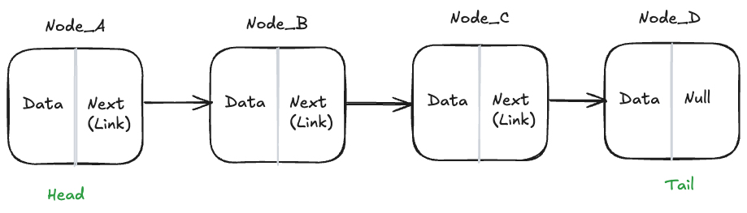

# Singly Linked Lists

A singly linked list is a data structure that consists of a sequence of nodes. Each node contains data and a reference (or link) to the next node in the sequence. The first node is called the head, and the last node is called the tail. The tail node has a reference to null, indicating the end of the list.

There are two main types of linked lists: singly linked lists and doubly linked lists. In a singly linked list, each node contains a reference to the next node in the sequence. In a doubly linked list, each node contains references to both the next node and the previous node in the sequence.

Linked lists are commonly used to implement other data structures like stacks, queues, and graphs.