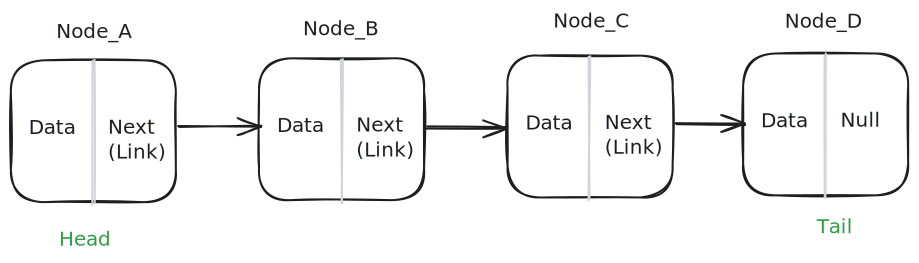

# Singly Linked Lists

A singly linked list is a data structure that consists of a sequence of nodes. Each node contains data and a reference (or link) to the next node in the sequence. The first node is called the head, and the last node is called the tail. The tail node has a reference to null, indicating the end of the list.

There are two main types of linked lists: singly linked lists and doubly linked lists. In a singly linked list, each node contains a reference to the next node in the sequence. In a doubly linked list, each node contains references to both the next node and the previous node in the sequence.

Linked lists are commonly used to implement other data structures like stacks, queues, and graphs.

## Common Operations

- **Insertion**: Add a new node to the list.

- **Deletion**: Remove a node from the list.

- **Traversal**: Traveling through the list to access or modify the nodes.

- **Search**: Find a node with a specific value.

- **Access**: Retrieve the value of a node at a specific position.

## Complexities

### Time Complexity

For searching and accessing an element in a singly linked list, the time complexity is O(n) in the worst case, as we may have to traverse the entire list to find the element. For insertion and deletion, the time complexity is O(1) when inserting or deleting from the head of the list, as we only need to update the head reference. For inserting or deleting from any other location in the list, the time complexity is O(n), as we may have to traverse the list to find the location.

| Access | Search |   Insertion    |    Deletion    |
| :----: | :----: | :------------: | :------------: |
|  O(n)  |  O(n)  | O(1) - on head | O(1) - on head |
|        |        | O(n) - on any  | O(n) - on any  |
|        |        | other location | other location |
|        |        |  (Traversing)  |  (Traversing)  |

### Space Complexity

Space complexity is O(n) for a singly linked list, as we need to allocate memory for each node in the list.

## Use Cases

Singly linked lists are used in a variety of applications. For example, singly linked lists are used in web browsers to implement the history feature. In text editors, singly linked lists are used to implement undo functionality. In operating systems, singly linked lists are used to manage processes and tasks. In computer science, singly linked lists are used in algorithms like depth-first search and depth-first traversal of trees.

## References

- [Codecademy](https://www.codecademy.com)
