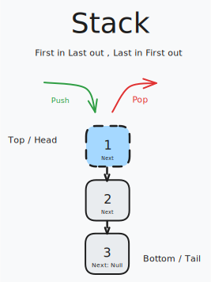

# Stack

Stacks are another data structure with a perfectly descriptive name. Like a queue, a stack is a linear collection of nodes that adds (pushes) data to one end of the data structure. However, unlike a queue, a stack removes data (pops) from the same end of the data structure. Think of it as a stack of books, where you can only pick up the top book, and add a new book to the top.

Stacks mimic a physical “stack” of objects. Consider a set of gym weights.

Each plate has a weight (the data). The first plate you add, or push, onto the floor is both the bottom and top of the stack. Each weight added becomes the new top of the stack. At any point, the only weight you can remove, or pop, from the stack is the top one. You can peek and read the top weight without removing it from the stack. The last plate that you put down becomes the first, and only, one that you can access. This is a Last In, First Out or LIFO structure. A less frequently used term is First In, Last Out, or FILO.

Stacks can be implemented using a linked list as the underlying data structure because it’s more efficient than a list or array. Depending on the implementation, the top of the stack is equivalent to the head node of a linked list and the bottom of the stack is equivalent to the tail node. A constraint that may be placed on a stack is its size. This is done to limit and quantify the resources the data structure will take up when it is “full”. Attempting to push data onto an already full stack will result in a stack overflow. Similarly, if you attempt to pop data from an empty stack, it will result in a stack underflow.

## Common Operations

- **Push**: Adds data to the “top” of the stack

- **Pop**: Returns and removes data from the “top” of the stack

- **Peek**: Returns data from the “top” of the stack without removing it

- **IsEmpty**: Determines if the stack is empty

- **IsFull**: Determines if the stack is full

## Complexities

### Time Complexity

| Push | Pop  | Peek | IsEmpty | IsFull |
| :--: | :--: | :--: | :-----: | :----: |
| O(1) | O(1) | O(1) |  O(1)   |  O(1)  |

### Space Complexity

If there are n elements in the stack, then there are n nodes in the linked list. Each node requires space proportional to the size of the data and the pointer. However, since we are typically interested in the number of elements stored, the space required grows linearly with the number of elements.

Thus, the space complexity is O(n) , where n is the number of elements in the stack.

## Use Cases

A real-world computing example of a stack is a web browser’s back/forward function. Each page you visit is added to a stack of pages. When you click the back button, you pop a page off the stack and go back to the previous page. When you click the forward button, you push a page onto the stack and go forward to the next page.

## References

- [Codecademy](https://www.codecademy.com)
