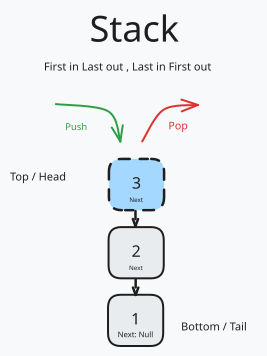

# Stack

Stacks are another data structure with a perfectly descriptive name. Like a queue, a stack is a linear collection of nodes that adds (pushes) data to one end of the data structure. However, unlike a queue, a stack removes data (pops) from the same end of the data structure. Think of it as a stack of books, where you can only pick up the top book, and add a new book to the top.

Stacks mimic a real-world stack of objects, like a stack of plates or a stack of books. When you add a new plate to the stack, you place it on top of the existing plates. When you remove a plate from the stack, you take the top plate off the stack. This is known as the Last In First Out (LIFO) principle.

Stacks can be implemented using a linked list as an underlying data structure or an array. In a linked list stack, each element in the stack is stored in a node, and each node has a reference to the next node in the stack. The top of the stack is the first node in the list, and the bottom of the stack is the last node in the list. In an array stack, the top of the stack is the last element in the array, and the bottom of the stack is the first element in the array. When an element is pushed onto the stack, it is added to the end of the array. When an element is popped from the stack, the last element in the array is removed.

A constraint that may be put on the stack is it's size. If a stack has a limit on the amount of data that can be placed into it, it is considered a bounded stack. Attempting to push data onto an already full stack will result in a stack overflow. If you attempt to pop data from an empty stack, it will result in a stack underflow.

## Common Operations

- **Push**: Adds data to the “top” of the stack

- **Pop**: Returns and removes data from the “top” of the stack

- **Peek**: Returns data from the “top” of the stack without removing it

- **IsEmpty**: Determines if the stack is empty

- **IsFull**: Determines if the stack is full

## Complexities

### Time Complexity

| Push | Pop  | Peek | IsEmpty | IsFull |
| :--: | :--: | :--: | :-----: | :----: |
| O(1) | O(1) | O(1) |  O(1)   |  O(1)  |

### Space Complexity

If there are n elements in the stack, then there are n nodes in the linked list. Each node requires space proportional to the size of the data and the pointer. However, since we are typically interested in the number of elements stored, the space required grows linearly with the number of elements.

Thus, the space complexity is O(n) , where n is the number of elements in the stack.

## Use Cases

A real-world computing example of a stack is a web browser’s back/forward function. Each page you visit is added to a stack of pages. When you click the back button, you pop a page off the stack and go back to the previous page. When you click the forward button, you push a page onto the stack and go forward to the next page.
